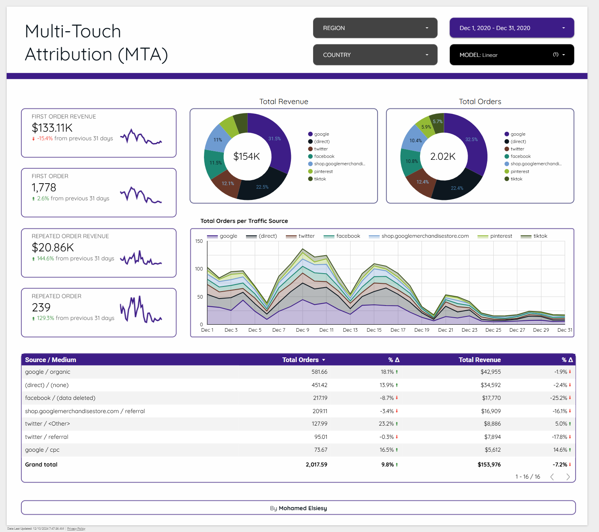
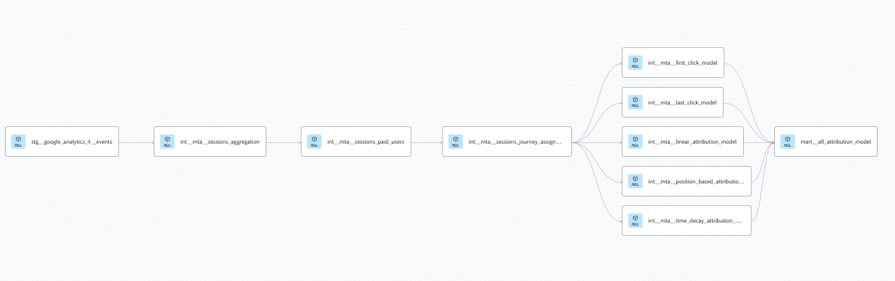

# Multi-Touch Attribution (MTA) using Google Analytics 4 - Snowflake - DBT - Looker

---

## Project Overview

The **Multi-Touch Attribution (MTA) Project** is designed to transform and analyze Google Analytics 4 (GA4) event data using **dbt** (data build tool) and store the processed data in **Snowflake**. The project focuses on implementing various attribution models to understand user interactions and optimize marketing strategies.

[The Looker Studio Dashboard (live link)](https://lookerstudio.google.com/reporting/62c5e01b-e913-4775-896a-4bbc5402c435)

---

## Technologies Used

- **[Snowflake]**
  - Cloud-based data warehouse for storing and querying processed data.

- **[dbt Cloud (data build tool)]**
  - Tool for data transformation and modeling within the data warehouse.

- **[Looker Studio]**
  - Business intelligence (BI) tool for data visualization.
  
---

## Data Sources

### Google Analytics 4 (GA4) Events

- **Table:** `ga4_events`
- **Description:** Captures user interactions such as page views, purchases, and other custom events.
- **Source Configuration:** Defined in `models/staging/google_analytics_4/source.yml`

## Data Warehouse

### Snowflake

- **Purpose:** Stores raw and transformed data for analysis.
- **Schema:** Data is organized into distinct schemas for staging, intermediate, and mart layers.

## DBT Cloud

### Model Lineage

### dbt Models

### Staging Models

#### `stg__google_analytics_4__events`

- **Location:** `models/staging/google_analytics_4/stg__google_analytics_4__events.sql`
- **Description:** Cleans and prepares raw GA4 event data for transformation.

### Intermediate Models

#### `int__mta__sessions_aggregation`

#### `int__mta__sessions_paid_users`

#### `int__mta__sessions_journey_assignment`

#### `int__mta__first_click_model`

#### `int__mta__last_click_model`

#### `int__mta__linear_attribution_model`

#### `int__mta__position_based_attribution_model`

#### `int__mta__time_decay_attribution_model`

- **Location:** `models/intermediate/mta/`
- **Description:** Aggregates and processes session-level data to assign user journeys and prepare for attribution modeling.

### Mart Models

#### `mart__all_attribution_model`

- **Location:** `models/mart/`
- **Description:** Union various attribution models to analyze the impact of different marketing channels on user behavior and conversions.

